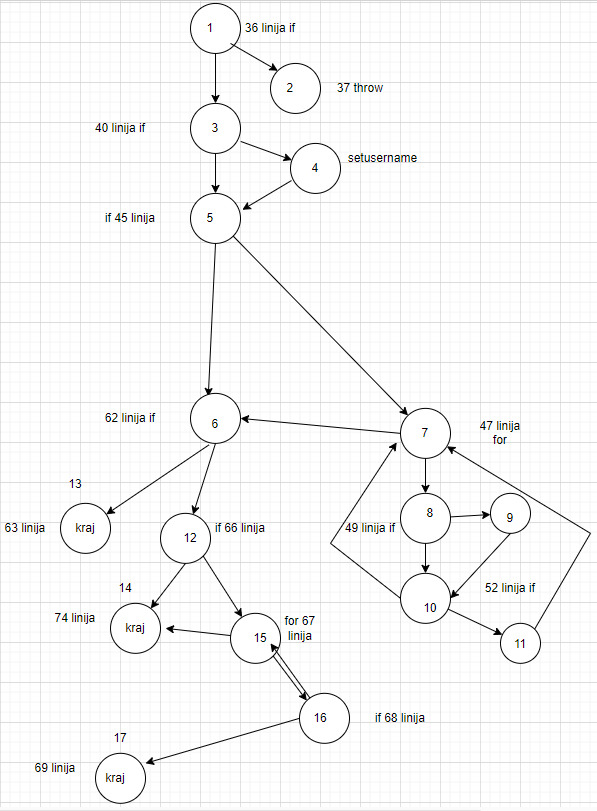

Дарко Илиоски, бр. на индекс 202042

Control Flow Graph

# Цикломатска комплексност
Regions се 8
Nodes се 17
Edges 23
V(G) = E - N + 2
= 23 - 17 + 2
= 8

# Every branch
За:
"user = null
allUsers=[]"

1 и 2

За:
"user = { password: ""123"", email: ""email@email.com"", username: null }
allUsers = [{ password: ""234"", email: ""email@email.com"", username: ""email@email.com""}]"
од 3 до 11, и 13

За:
"user = { password: ""!1234 56789"", email: ""email@email.com"", username: null }
allUsers = [{ password: ""23467899"", email: ""email@email.com"", username: ""email@email.com""}]  "
12 и 14

За:
"user = { password: ""!123456789"", email: ""email@email.com"", username: null }
allUsers = [{ password: ""23467899"", email: ""email@email.com"", username: ""email@email.com""}]  "
15, 16 и 17

# Multiple Condition
user==null || user.getPassword()==null || user.getEmail()==null
A = user==null
B = user.getPassword()==null
C = user.getEmail()==null
A || B || C

A=T, B=X, C=X -> 2 т.е. throw new RuntimeException("Mandatory information missing!");
A=F, B=T, C=X -> 2 т.е. throw new RuntimeException("Mandatory information missing!");
A=F, B=F, C=T -> 2 т.е. throw new RuntimeException("Mandatory information missing!");
A=F, B=F, C=F -> 3 т.е. нема да направи throw туку ќе продолжи на следниот чекор